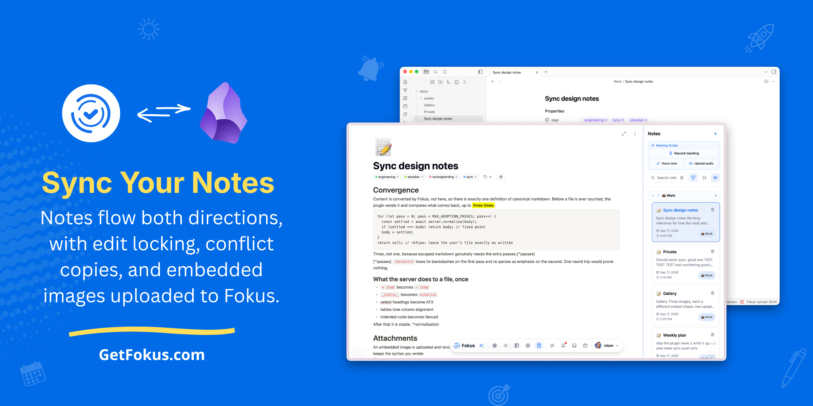

---
tags:
  - engineering
  - sync
  - obsidian
status: living
---

# Sync design notes

Working reference for how the vault and Fokus stay in step. Written while building it, kept because the reasoning is easy to forget and expensive to rediscover.

## Why a mirror and not a diff

Obsidian gives us a **file watcher**, not a changelog. We only ever learn *"this
path changed"*, never *what* changed — so the plugin keeps a small mirror of
what it last agreed with the server and compares against that.

Three rules fall out of it, and they are worth stating plainly:

1. Hash the *canonical markdown*, never the stored JSON.
2. Never write a file whose hash already matches.
3. Treat a missing mirror as "re-link", never as "re-create".

Rule 1 is the load-bearing one. A Fokus edit rewrites ProseMirror attributes the
converter omits — `textAlign: null` on every block, `colwidth: null` on table
cells — so comparing JSON reads *every* remote edit as a change and syncs
forever. Comparing rendered markdown is stable.

## The state machine

| Local | Remote | Outcome | Loses anything? |
| --- | --- | --- | --- |
| unchanged | unchanged | nothing | no |
| changed | unchanged | push | no |
| unchanged | changed | pull | no |
| changed | changed | conflict copy | no |
| missing | exists | unlink | no |
| exists | missing | re-create | no |

The bottom-right cell is the one people get wrong. Deleting never propagates:
a file can vanish because of a move, a sync hiccup, or a stray keystroke, and
acting on that is not recoverable. test sync.

> [!warning] The only irreversible operation is a write
> Everything else — unlinking, refusing, backing off — can be undone by syncing
> again. A write that destroys content cannot. When in doubt, refuse.

## Convergence

Content is converted by Fokus, not here, so there is exactly one definition of canonical markdown. Before a file is ever touched, the plugin sends it and compares what comes back, up to ==three times==:

```ts
for (let pass = 0; pass < MAX_ADOPTION_PASSES; pass++) {
  const settled = await server.normalise(body);
  if (settled === body) return body; // fixed point
  body = settled;
}
return null; // refuse: leave the user's file exactly as written
```

Three, not one, because escaped markdown genuinely needs the extra passes.[^passes]

[^passes]: `\*stars\*` loses its backslashes on the first pass and re-parses as emphasis on the second. One round trip would prove nothing.

### What the server does to a file, once

- `* item` becomes `- item`
- `_italic_` becomes `*italic*`
- setext headings become ATX
- tables lose column alignment
- indented code becomes fenced

After that it is stable. ^normalisation

## Attachments

An embedded image is uploaded and rendered in Fokus, while the file on disk
keeps the syntax you wrote:

![[banner.png]]

Sized embeds and markdown embeds both survive:

![[banner.png|240]]



The plugin keeps a private map from embed text to uploaded URL and translates
both ways, so the two views never have to agree on syntax. Uploads are paced to
stay inside the server's limit of $10$ per minute — a note with fifty images
takes a few minutes rather than being refused half way.

## Things that genuinely do not survive

Documented rather than pretended away:

- escaped markdown — `\*stars\*` loses its backslashes
- `[text](<path with spaces.md>)` loses its angle brackets, and the link with them
- a plain bullet in a list that also contains a task becomes a task

%%Reviewer note: the table-cell alias case is the nastiest of these — it eats a
cell — so it is deliberately not demonstrated in the table above.%%

## Related

- Obsidian's own docs: [https://docs.obsidian.md/plugins/guides/secret-storage](https://docs.obsidian.md/plugins/guides/secret-storage)

<!-- kept as raw HTML on purpose: it round-trips unchanged -->

---

*Last reviewed after the first real-vault sync.* #review/pending